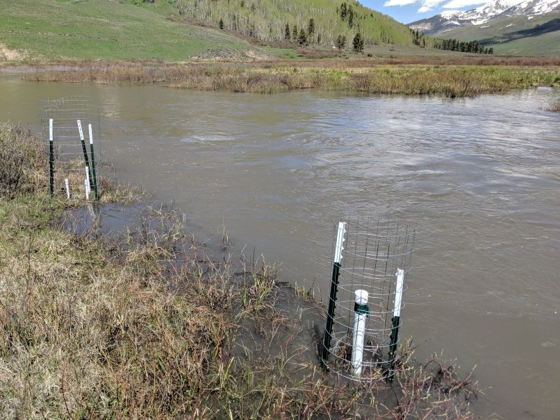
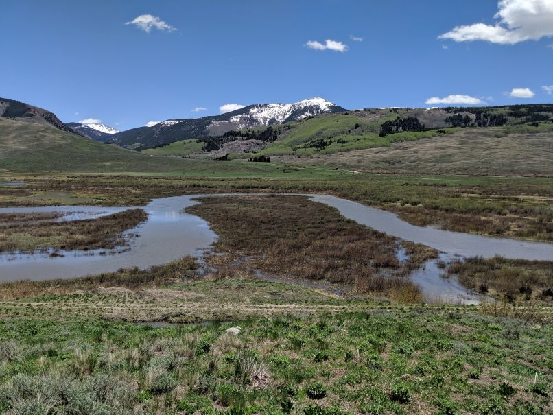
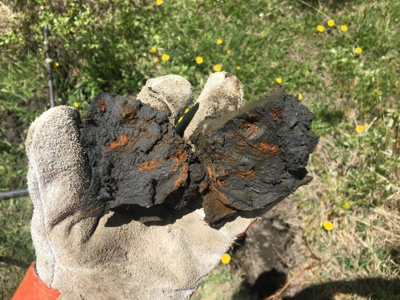
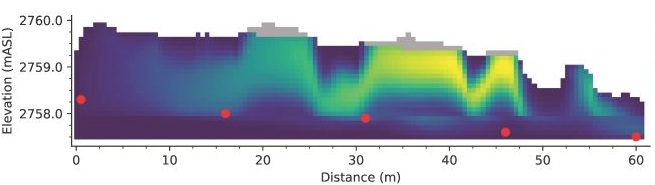

## **Environmental Soil Chemistry**
#### **Dewey Lab**

---

In the Dewey lab, we seek to understand the <b>coupled geochemical, biological, and hydrological processes</b> that govern the mobility and uptake of <b>contaminants</b> and <b>nutrients</b> in soils, as well as those that underpin soil <b>carbon budgets</b>. We use advanced analytical techniques (X-ray absorption, liquid chromatography with online mass spectrometry) to investigate these processes at a molecular scale, and we incorporate our molecular insights into new reactive transport models. With these models, we project the impacts of global climate change on fluxes of contaminants, nutrients, and carbon across watersheds and ecosystems. Importantly, our analytical and computational work is always grounded in observations and measurements from the field.

  <figure class="gallery__item gallery__item--1">
    
  </figure>
  <figure class="gallery__item gallery__item--6">
    
  </figure>
  <figure class="gallery__item gallery__item--3">
    
  </figure>

  <figure class="gallery__item gallery__item--5">
    
  </figure>

